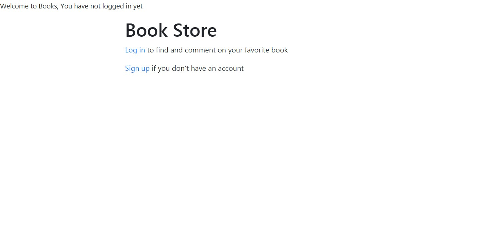

http://book-review-by-j.herokuapp.com/login

# Books

# Introduction
Books is a book review website where readers can share their opinion on books freely. Here, users are able to registered for this website and login with their account. Once they login, users can search for books they want to review and give rate on.

# Package
Please refers to requirement.txt for more details

# Feature
1. When user enters Books website, they can signup an account and login with a username and password. If user try to sign up a account that has been in database, error messages will be displayed on the page.
2. Once they login, they can search for books they want. There are three search fields, including isbn, title and author. Once these fields are submitted to Flask backend, they are translated to query string and sent to goodread. The result of query will be listed by revelance that are defined by goodread algorithms.
3. Bootstrap's list-group styles search list to make page responsive. Search list contains search items with each containing a hyperlink to book detail page. When user hover thier mouse on any search item, color of item under the mouse will be alternating between blue and white. This visual effect helps user focus on the search item that will be clicked on.
3. When user click on any book on the list, book detail will be displayed in term of isnb, title, author, publish year, average rating and rating counts.
4. If detail of that particular book has not been viewed before, Books backend will query detail of that book from goodread. Once Books backend gets the response, Books will trigger celery to  store response in database. Without waiting , response will be returned to client immediately after the celery is triggered.
5. User can give a review and rating to a book. If user has left a review, any more submission of review will not be updated on the site. Also, average ratings will be caculated and displayed in the review section.
6. User can rate the book with scroll bar. Scroll bar contains a jar that reflects degree of rating, while a circle pin move along the jar to determine rating. To inform user about rating, javascript will keep track of rating of the scroll bar and update current rating on the rating panel. 
# Demo
[video demo](https://www.youtube.com/watch?v=iFNce76pEf8&feature=youtu.be)

